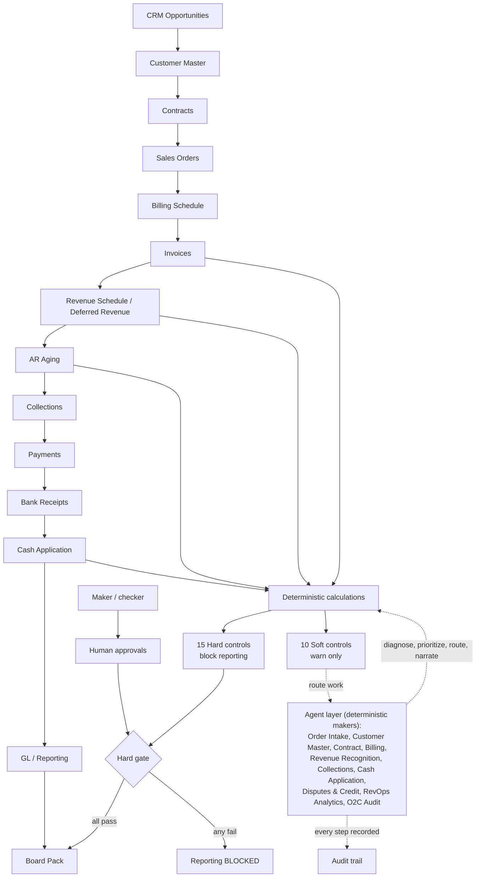

# AI-Native Revenue Operations / Order-to-Cash Control Tower

This module extends the CFO Office agentic operating model into Revenue
Operations and Order-to-Cash. It connects CRM, customer master, contracts, sales
orders, billing schedules, invoices, revenue recognition, collections, disputes,
cash application, bank receipts, and credit limits into one deterministic and
auditable finance-operations workflow.

It is **agent-first but human-led**. Finance numbers are computed deterministically
in code; agents diagnose exceptions, prioritize work, explain variances, route
approvals, and draft actions, but they never invent a number. Hard controls block
downstream reporting if CRM, billing, revenue recognition, cash application, AR,
or deferred revenue do not tie out.

> The data here is **synthetic and illustrative**, generated deterministically
> with seeded exceptions so the controls have a known ground truth. It is not a
> real company's data. The point is the operating model, the controls, and the
> agentic workflow, in runnable code.

## Architecture: Agent-First, Human-Led O2C Control Tower



The chain on top is the source-to-cash flow; every number on it is computed in
`o2c_core.py`. The agent layer reads those numbers, diagnoses exceptions,
prioritizes work, routes approvals, and narrates - it never invents a figure.
The control layer turns the numbers into 15 hard controls (which gate reporting)
and 10 soft controls (which route work), with maker/checker human approvals and a
full audit trail.

## Why O2C is its own sub-orchestrator

The CFO Office already runs the month-end close (`cfo-office/cfo_orchestrator.py`).
Order-to-Cash is a different operating loop with different owners (RevOps,
Billing, Revenue Accounting, Collections, Treasury, Credit) and a different cadence
(continuous, not monthly). So it gets its own sub-orchestrator,
`o2c_orchestrator.py`, that owns the CRM-to-cash chain end to end and reuses the
same governance pattern as the close: deterministic numbers, a shared audit trail,
maker/checker sign-off, and a hard gate.

## The 15 datasets (`data/`)

A coherent relational chain with referential integrity, multi-entity,
multi-region (NA / EMEA / LATAM), multi-currency (USD, EUR, GBP, BRL, MXN, ARS):

| Dataset | What it represents |
|---|---|
| `customer_master.csv` | Customers: entity, region, currency, segment, terms, credit, owners |
| `crm_opportunities.csv` | CRM pipeline and closed-won deals |
| `contracts.csv` | Signed contracts, billing model, rev-rec method, terms |
| `sales_orders.csv` | Provisioned orders, billing blocks |
| `billing_schedule.csv` | Scheduled bill lines by service period |
| `invoices.csv` | Issued invoices, tax, GL accounts |
| `credit_memos.csv` | Credits against invoices |
| `payments.csv` | Customer payments and remittance |
| `bank_receipts.csv` | Bank-side cash with FX rate |
| `cash_application.csv` | Application of cash to invoices |
| `revenue_schedule.csv` | Recognized and deferred revenue by month |
| `deferred_revenue_rollforward.csv` | Deferred revenue rollforward by contract/entity |
| `collections_activity.csv` | Dunning, promises to pay, escalations |
| `disputes.csv` | Disputed invoices and blocked cash |
| `credit_limits.csv` | Credit policy, exposure, utilization, reviews |

Regenerate deterministically (fixed seed, no network, no API key). This writes
both periods into `data/<period>/`:

```
python cfo-office/o2c/generate_data.py
```

### Two scenarios (so you can demo both outcomes)

- **`2026-05` (problematic)** seeds a known count of each exception type, so the
  run is **`BLOCKED_HARD_CONTROLS`** with an ADVERSE audit opinion.
- **`2026-06` (clean)** has no seeded exceptions and positive guarantees (credit
  limits cover exposure, credit-hold customers carry no active orders, every due
  billable line is invoiced at the scheduled amount), so the source data ties out
  and **all hard controls PASS** (`PASS_WITH_WARNINGS`, UNQUALIFIED opinion). It
  still carries realistic soft warnings. The controls and thresholds are
  **identical** across periods - only the data differs.

The generator seeds a known count of each exception type (closed-won not
contracted, unbilled work, invoice mismatches, duplicate invoices, unapplied cash,
revenue cutoff breaks, deferred rollforward breaks, credit-limit breaches, and
more) and prints the manifest, so the controls have a ground truth to catch and
the tests can assert exactly those breaks.

## The agents (makers)

Each agent is a deterministic class (no LLM, no API key). It reads the core
calculations, produces structured findings and a templated narrative built from
those numbers, raises escalations, and proposes actions. A human checker signs off.

| Agent | Purpose | Checker (HITL) |
|---|---|---|
| `OrderIntakeAgent` | CRM -> contract -> order conversion gaps | RevOps Lead |
| `CustomerMasterAgent` | Customer data quality, credit-hold/order conflicts | Finance Operations Manager |
| `ContractAgent` | Contract terms, rev-rec method, renewal risk | Revenue Operations Manager |
| `BillingAgent` | Billing completeness, accuracy, timeliness, leakage | Billing Manager |
| `RevenueRecognitionAgent` | Cutoff, deferred rollforward, recognized-vs-invoiced | Revenue Accounting Manager |
| `CollectionsAgent` | Aging, priorities, cash forecast, risk scoring | Collections Manager |
| `CashApplicationAgent` | Cash-to-bank tie-out, unapplied, short/over, FX | Treasury / AR Manager |
| `DisputesCreditAgent` | Disputed/blocked cash, credit breaches, hold violations | Credit & Commercial Finance Manager |
| `RevOpsAnalyticsAgent` | Bookings-to-cash bridge, DSO bottlenecks, board narrative | FP&A Director |
| `O2CAuditAgent` | Independent re-performance, audit score and opinion | Controller / Internal Controls |

## Controls that block reporting

`o2c_controls.py` runs **15 HARD controls** (a failure blocks downstream
reporting) and **10 SOFT controls** (warnings that route work but do not block).
Each control re-derives its answer from the source records and returns the failing
records, the failing amount, the owner/checker, and a recommended action.

Hard controls: closed-won-to-contract, contract-to-order, order-to-billing,
billing completeness, invoice accuracy, PO-required, duplicate invoices, AR
subledger tie-out, cash-receipt-to-bank, cash-application completeness, revenue
recognition cutoff, deferred revenue rollforward, credit-limit breach, credit-hold
new-order block, and dispute-collection segregation.

A hard failure sets the run status to `BLOCKED_HARD_CONTROLS`; with
`--fail-on-hard-controls` the orchestrator exits non-zero (a CI gate).

## How HITL (maker/checker) works

Every agent is a **maker**; a named domain expert is the **checker**. In an
interactive run each finding is presented for sign-off; in batch/CI runs the
review auto-approves and is recorded explicitly as `auto` in the audit trail. An
`auto` record is never presented as a real human sign-off. Set `O2C_INTERACTIVE=1`
to require a human at the console. The final gate is a Controller / CFO sign-off on
the consolidated pack, which cannot clear while any hard control fails.

## How the audit trail works

Every run records a `run_id`, timestamp, period, input files and record counts,
the calculations performed, the controls run, the agents run, the hard failures
and soft warnings, the human approvals required (and how they were obtained), the
audit score and opinion, the output files, and the final status. It is written to
`outputs/o2c_audit_trail.json`. The `O2CAuditAgent` independently re-performs the
critical tie-outs (open AR, cash, deferred) rather than trusting the reported
numbers, and issues an opinion (unqualified / qualified / adverse).

## How to run

```
# 1) one-command control tower (status, metrics, hard failures, top issues)
python run_o2c_control_tower.py

# 2) side-by-side: the problematic period vs the clean period
python run_o2c_control_tower.py --compare

# 3) full orchestrator per period (writes all 8 outputs)
python cfo-office/o2c/o2c_orchestrator.py --period 2026-05   # BLOCKED_HARD_CONTROLS
python cfo-office/o2c/o2c_orchestrator.py --period 2026-06   # PASS_WITH_WARNINGS

# 4) CI gate: non-zero exit if any hard control fails
python cfo-office/o2c/o2c_orchestrator.py --period 2026-05 --fail-on-hard-controls

# 5) tests (pytest if available, else the bundled runner)
python -m pytest cfo-office/o2c/tests
python cfo-office/o2c/tests/run_tests.py
```

## Outputs (`outputs/`)

`o2c_control_results.csv`, `o2c_metrics.csv`, `o2c_exceptions.csv`,
`o2c_agent_findings.json`, `o2c_audit_trail.json`, `o2c_executive_summary.md`,
`o2c_board_pack.md`, `o2c_workflow_map.md`. They are reproducible from the
committed data, so they are git-ignored; run the orchestrator to generate them.

## Module map

```
o2c_policy.py          thresholds, materiality, FX, owners, HITL checker map
generate_data.py       deterministic synthetic data + seeded exceptions
o2c_data_loader.py     load, validate schema, normalize to USD
o2c_core.py            deterministic calculations (the only source of numbers)
o2c_controls.py        15 hard + 10 soft controls (ControlResult)
o2c_metrics.py         35-metric framework with status bands
o2c_orchestrator.py    load -> calc -> controls -> agents -> gate -> outputs
agents/                10 deterministic maker agents + base class
tests/                 6 test modules + fallback runner
```

## What this supports

Finance operations workflows (billing, collections, cash application,
reconciliations, close support), RevOps and Order-to-Cash logic, billing controls,
collections risk scoring, revenue recognition checks, CRM/ERP/billing
reconciliation, exception handling, approval gates, an audit trail, a metrics
framework, and executive-ready reporting narratives.

## Interview talking points

- **Agent-first, human-led.** Agents diagnose, prioritize, explain, and route;
  humans approve at maker/checker checkpoints; nothing material ships without a
  sign-off and a clean hard-control gate.
- **Deterministic numbers.** Every figure is computed in `o2c_core.py` from source
  records and is reproducible. Agents never produce a number on their own.
- **Controls that actually block.** 15 hard controls tie CRM, billing, revenue,
  cash, AR, and deferred revenue; a failure blocks reporting and exits non-zero in
  CI.
- **Multi-entity, multi-region, multi-currency** by construction, consolidated to
  USD with an explicit FX table.
- **Auditable end to end.** Independent re-performance, an opinion, and a full
  audit trail of who-decided-what-when.

### Interview script

> I built this as an agent-first but human-led O2C operating model. The agents do
> not invent numbers. All finance calculations are deterministic. The agents
> diagnose exceptions, prioritize work, explain variances, and route approvals.
> Hard controls block downstream reporting if CRM, billing, revenue recognition,
> cash application, AR, or deferred revenue do not tie out. The design connects
> RevOps, Accounting, Treasury, FP&A, and Internal Controls.
